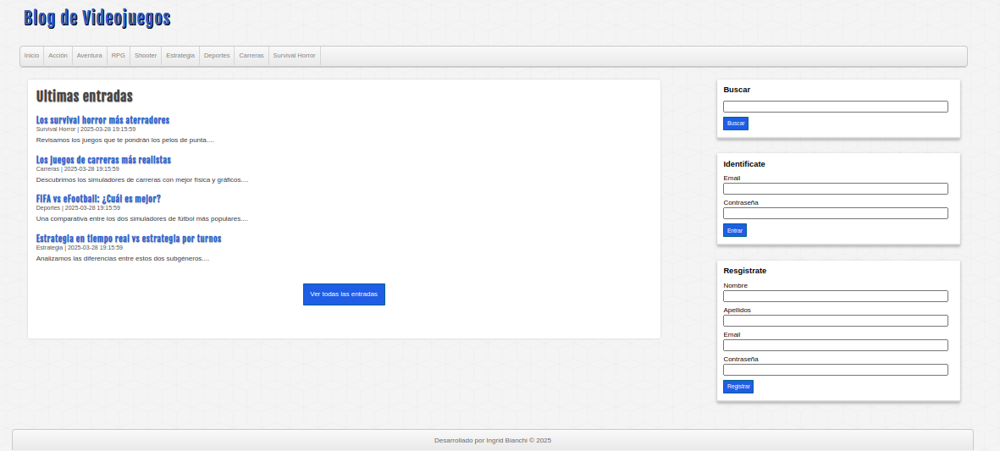

# Video Game Blog

This is a video game blog project developed in PHP with MySQL as the database. It allows users to register, log in, create posts, categories, and search for content.

## Preview

## Features

- User registration and login.
- Creation and management of blog posts.
- Creation of categories to organize posts.
- Search for posts by keywords.
- Responsive design with HTML and CSS.
- Mobile-friendly responsive design.
- Integrated Docker environment.

## Requirements

- Docker >= 20.10
- Docker Compose >= 1.29
- Modern browser (Chrome 90+, Firefox 88+)
- Internet connection to download base Docker images.

## Project Structure

proyecto-php/
├── assets/                # Static files (CSS, images, fonts)
│   ├── css/
│   │   └── style.css      # Project styles
│   ├── fonts/
│   │   └── fuente.ttf     # Custom font
│   └── img/               # Project images
├── includes/              # Reusable PHP files
│   ├── cabecera.php       # Site header
│   ├── conexion.php       # Database connection
│   ├── helpers.php        # Helper functions
│   ├── lateral.php        # Sidebar
│   ├── pie.php            # Footer
│   └── redireccion.php    # Redirection for unauthenticated users
├── public/                # Files accessible from the browser
│   ├── index.php          # Main page
│   ├── login.php          # Login
│   ├── registro.php       # User registration
│   ├── categoria.php      # Posts by category
│   ├── entrada.php        # Post details
│   ├── crear-entradas.php # Create new posts
│   ├── crear-categoria.php # Create new categories
│   ├── buscar.php         # Search for posts
│   └── ...                # Other related files
├── sql/
│   └── database.sql       # Script to create the database and tables
├── Dockerfile             # PHP container configuration
├── docker-compose.yml     # Docker services configuration
├── nginx.conf             # Nginx server configuration
├── php.ini                # PHP configuration
└── README.md              # Project documentation

## Installation and Configuration

1. **Clone the repository**:

git clone https://github.com/tu-usuario/blog-videojuegos.git
cd blog-videojuegos

2. **Set up the environment with Docker**:
   Ensure Docker and Docker Compose are installed on your system.

   Build and start the containers:

docker-compose up --build

3. **Access the application**:
   - Blog: [http://localhost:8082](http://localhost:8082)
   - phpMyAdmin: [http://localhost:8081](http://localhost:8081)

4. **Configure the database**:
   - Access phpMyAdmin at [http://localhost:8081](http://localhost:8081).
   - Use the following credentials:
     - Username: `root`
     - Password: `mi_nueva_contrasea`
   - Import the `sql/database.sql` file to create the tables and initial data.

## Usage

- **Registration**: Users can register on the blog.
- **Login**: Registered users can log in with their credentials.
- **Create Posts**: Authenticated users can create new posts.
- **Categories**: Users can explore content by categories.
- **Search**: Users can search for posts by keywords.

## Technologies Used

- **Backend**: PHP 8.2 with `pdo_mysql` and `mysqli` extensions.
- **Frontend**: HTML5, CSS3.
- **Database**: MySQL 8.0.
- **Web Server**: Nginx.
- **Container Management**: Docker and Docker Compose.

## Common Issues

1. **Port 8082 is occupied**:
   Change the port in `docker-compose.yml`:

services:
  nginx:
    ports:
      - "8083:80"  # Change local port

2. **Database connection error**:
   - Verify that the `mysql_db` container is running:

docker ps

   - Restart the MySQL container:

docker-compose restart mysql_db

3. **PHP errors not visible**:
   Ensure `php.ini` has error display enabled:

display_errors = On
display_startup_errors = On
error_reporting = E_ALL

## Contributions

If you wish to contribute to the project, please open an issue or submit a pull request.

## License

This project is under the MIT License. See the `LICENSE` file for more details.